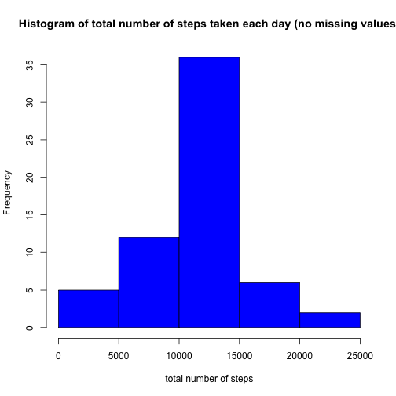

In this file you will find my report for the *Peer Assessment 1* of the [Reproducible Research][a] course offered by [Coursera][b]

[a]: https://www.coursera.org/course/repdata "Reproducible Research"
[b]: https://www.coursera.org/ "Coursera"


### Loading and preprocessing the data
In this section, I wrote the r code needed to load and preprocess the data to be used in this assignment.


```r
setwd("/Users/mmfonseca/Documents/work/cursos/2015_Reproducible_Research/Peer_Assessment_1")

## loading the data
ActivityData <- read.csv("activity.csv")
```

The table is already in a suitable format for the analysis.
Check, for example, the first 10 lines of the table (blank cells correspond to "NA"):

```r
library(xtable)
xt <- xtable(head(ActivityData))
print(xt, type = "html")
```

<!-- html table generated in R 3.1.2 by xtable 1.7-4 package -->
<!-- Mon Apr 20 00:20:25 2015 -->
<table border=1>
<tr> <th>  </th> <th> steps </th> <th> date </th> <th> interval </th>  </tr>
  <tr> <td align="right"> 1 </td> <td align="right">  </td> <td> 2012-10-01 </td> <td align="right">   0 </td> </tr>
  <tr> <td align="right"> 2 </td> <td align="right">  </td> <td> 2012-10-01 </td> <td align="right">   5 </td> </tr>
  <tr> <td align="right"> 3 </td> <td align="right">  </td> <td> 2012-10-01 </td> <td align="right">  10 </td> </tr>
  <tr> <td align="right"> 4 </td> <td align="right">  </td> <td> 2012-10-01 </td> <td align="right">  15 </td> </tr>
  <tr> <td align="right"> 5 </td> <td align="right">  </td> <td> 2012-10-01 </td> <td align="right">  20 </td> </tr>
  <tr> <td align="right"> 6 </td> <td align="right">  </td> <td> 2012-10-01 </td> <td align="right">  25 </td> </tr>
   </table>

### What is mean total number of steps taken per day?

*1. Calculate the total number of steps taken per day*

```r
## In the following command, the number of steps taken per day will be summed up
StepsPerDay <- aggregate(steps ~ date, data = ActivityData, sum)

## just to show how the table looks like
xt <- xtable(head(StepsPerDay))
print(xt, type = "html")
```

<!-- html table generated in R 3.1.2 by xtable 1.7-4 package -->
<!-- Mon Apr 20 00:20:25 2015 -->
<table border=1>
<tr> <th>  </th> <th> date </th> <th> steps </th>  </tr>
  <tr> <td align="right"> 1 </td> <td> 2012-10-02 </td> <td align="right"> 126 </td> </tr>
  <tr> <td align="right"> 2 </td> <td> 2012-10-03 </td> <td align="right"> 11352 </td> </tr>
  <tr> <td align="right"> 3 </td> <td> 2012-10-04 </td> <td align="right"> 12116 </td> </tr>
  <tr> <td align="right"> 4 </td> <td> 2012-10-05 </td> <td align="right"> 13294 </td> </tr>
  <tr> <td align="right"> 5 </td> <td> 2012-10-06 </td> <td align="right"> 15420 </td> </tr>
  <tr> <td align="right"> 6 </td> <td> 2012-10-07 </td> <td align="right"> 11015 </td> </tr>
   </table>
<br>

*2. Make a histogram of the total number of steps taken each day*

```r
## Draw the histogram
hist(StepsPerDay$steps, xlab="total number of steps", 
     main="Histogram of total number of steps taken each day", 
     col="lightblue")
```

 
<br>

*3. Calculate and report the mean and median of the total number of steps taken per day*

```r
## For this step, we can use the dataframe created previously (StepsPerDay)
## Note that missing data will be ignored
Mean_StepsPerDay <- mean(StepsPerDay$steps)

## Printing the mean value
show(Mean_StepsPerDay)
```

[1] 10766.19

```r
## Likewise, we can use the function "media()" to calculate the median of the total number
## of steps taken per day
## Note that missing data will be ignored
Median_StepsPerDay <- median(StepsPerDay$steps)

## Printing the median value
show(Median_StepsPerDay)
```

[1] 10765

> The mean of the total number of steps taken per day is **10766.19** and the median of the dataset is **10765**.
<br><br>

### What is the average daily activity pattern?
*1. Make a time series plot of the 5-minute interval (x-axis) and the average number of steps taken, averaged across all days (y-axis)*

```r
AverageStepsPerInterval <- aggregate(steps ~ interval, data = ActivityData, mean)
plot(AverageStepsPerInterval$steps, type="l", lwd=2, 
     ylab="Average Number of Steps", 
     xlab="Daily 5-minute interval",
     main="Time Series Plot"
     )
```

 
<br>

*2. Which 5-minute interval, on average across all the days in the dataset, contains the maximum number of steps?*

```r
## To get the max value of a given vector or column, one can use the function which.max
## this function will not report the max value per se, 
## instead it will report the index of the 5-minute interval that, on average, contains the maximum number of steps:
which.max(AverageStepsPerInterval$steps)
```

[1] 104
<br>

So, the above mentioned index interval (or row number), must corresponde to a specific interval. To get the name of the 5-minute interval, one can use the following:

```r
AverageStepsPerInterval$interval[which.max(AverageStepsPerInterval$steps)]
```

[1] 835

> The 5-minute interval that contains the maximum number of steps (on average across all the days in the dataset is the one named **835**.

### Imputing missing values
*1. Calculate and report the total number of missing values in the dataset (i.e. the total number of rows with NAs)*

```r
nrow(ActivityData[ActivityData$steps == "NA",])
```

[1] 2304

*2. Devise a strategy for filling in all of the missing values in the dataset. The strategy does not need to be sophisticated. For example, you could use the mean/median for that day, or the mean for that 5-minute interval, etc.*

*3. Create a new dataset that is equal to the original dataset but with the missing data filled in.*

I will answer both questions simultaneously using a for loop.
I will use the overall 5-minute interval mean to fill the missing values. To do this I will use the values from the dataframe "AverageStepsPerInterval". Thus, if in the original dataset the value of number of steps is missing, I will substitute it will the average number of steps for that 5-minute interval:


```r
ActivityData2 <- ActivityData

for (i in 1:nrow(ActivityData)){
    interval <- ActivityData$interval[i]
    nsteps <- ActivityData$steps[i]
    newvalue <- AverageStepsPerInterval[AverageStepsPerInterval$interval == interval,2]
    if (is.na(nsteps)){
        ActivityData2$steps[i] <- newvalue
    }
}
```
<br>

> The new dataframe with the missing values substituted with the specific 5-minute interval average was named `ActivityData2`.
<br>

*4. Make a histogram of the total number of steps taken each day and Calculate and report the mean and median total number of steps taken per day.*

Drawing the histogram based on the dataset with no missing values...

```r
StepsPerDay2 <- aggregate(steps ~ date, data = ActivityData2, sum)

hist(StepsPerDay2$steps, xlab="total number of steps", 
     main="Histogram of total number of steps taken each day (no missing values)", 
     col="blue")
```

 
<br>

And calculating and reporting the mean and median total number of steps taken per day.
Mean:

```r
Mean_StepsPerDay2 <- mean(StepsPerDay2$steps)
show(Mean_StepsPerDay2)
```

[1] 10766.19
Median:

```r
Median_StepsPerDay2 <- median(StepsPerDay2$steps)
show(Median_StepsPerDay2)
```

[1] 10766.19
<br>
*Do these values differ from the estimates from the first part of the assignment?*
The mean value does not change, but the median does because I have filled the original dataset with new values that made a change in the sample median.

```r
## Summarizing the dataset (daily steps average) before missing data was filled in
summary(StepsPerDay$steps)
```

   Min. 1st Qu.  Median    Mean 3rd Qu.    Max. 
     41    8841   10760   10770   13290   21190 

```r
## and after
summary(StepsPerDay2$steps)
```

   Min. 1st Qu.  Median    Mean 3rd Qu.    Max. 
     41    9819   10770   10770   12810   21190 

*What is the impact of imputing missing data on the estimates of the total daily number of steps?*
There is an impact on the quartiles and the median, but not on the minimum, maximum or mean values.
<br>

### Are there differences in activity patterns between weekdays and weekends?
*1. Create a new factor variable in the dataset with two levels – “weekday” and “weekend” indicating whether a given date is a weekday or weekend day.*
To create the new factor, I will use the fuction weekdays to the column "date" of the dataset "ActivityData2". The resultant vector will be added to the dataset.

```r
week_vector <- weekdays(as.Date(ActivityData2$date))

## adding the vector as a new column of ActivityData2
ActivityDataNew <- cbind(ActivityData2,week_vector)
```
